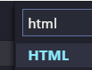
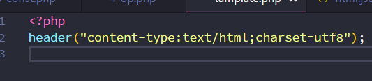

# VSCode 配置 PHP 开发

> 下面是索引
- [VSCode 配置 PHP 开发](#vscode-%E9%85%8D%E7%BD%AE-php-%E5%BC%80%E5%8F%91)
  - [插件获取](#%E6%8F%92%E4%BB%B6%E8%8E%B7%E5%8F%96)
  - [修改设置](#%E4%BF%AE%E6%94%B9%E8%AE%BE%E7%BD%AE)
  - [(New!) 自定义PHP代码片段(实际上是HTML)](#new-%E8%87%AA%E5%AE%9A%E4%B9%89php%E4%BB%A3%E7%A0%81%E7%89%87%E6%AE%B5%E5%AE%9E%E9%99%85%E4%B8%8A%E6%98%AFhtml)
    - [高玩点这里](#%E9%AB%98%E7%8E%A9%E7%82%B9%E8%BF%99%E9%87%8C)
> 随笔类型

> Debugger(断点调试)还在摸索中...

## 插件获取

> Tips: 大小写不一定准确, 搜索时可不输出完整单词, 进行模糊搜索

* PHP Debug
  断点准备
* PHP Extensition Pack
  后续扩展依赖(语法提示依赖)
* PHP IntelliSense
  语法提示, 安装后记得**关闭**系统提示, 否则引起冲突
* PHP Intelephense 高性能查错工具

## 修改设置

如果 phpStudy 安装在 D 盘, 可直接复制我的设置

```json
    "php.suggest.basic": false, // 关闭自带的基础建议

    "php.validate.enable": false, // 关闭自带的PHP验证(若安装了第三方验证则关闭)

    "php.validate.executablePath": "D:/phpStudy/php/php-5.4.45/php.exe", // 指向 PHP 可执行文件。


    // 此处仅支持 PHP 7 版本(扩展基于PHP远程调试), 若用 5 版本可以先不设置
    "php.executablePath": "D:/phpStudy/php/php-7.0.12-nts/php.exe", // 指向 PHP 可执行文件。
```
## (New!) 自定义PHP代码片段(实际上是HTML)

点击 文件 - 首选项 - 用户代码片段


弹出一个选项框, 输入`HTML`,回车



进入html的json设置, 显示以下代码

```json
{
	/*
	// Place your snippets for HTML here. Each snippet is defined under a snippet name and has a prefix, body and 
	// description. The prefix is what is used to trigger the snippet and the body will be expanded and inserted. Possible variables are:
	// $1, $2 for tab stops, $0 for the final cursor position, and ${1:label}, ${2:another} for placeholders. Placeholders with the 
	// same ids are connected.
	// Example:
	"Print to console": {
		"prefix": "log",
		"body": [
			"console.log('$1');",
			"$2"
		],
		"description": "Log output to console"
	}
*/

}
```
看到此处, 已经可以断定为example是**模版**, 小白请直接在最后一个**大扩号**前面复制我的代码, 上一个代码请**逗号**结束

如果看不懂上面的, 全选全部删除, 点下面链接跳转最终代码

<a href="#final">全部最终代码</a>

如下:
```json
// 命名, 此地方命名在提示中看不见
"Print to tamplate": {
		"prefix": "myTemplate", // 提示代码段(可自定义)
		"body": [
			"<?php",
			"header(\"content-type:text/html;charset=utf8\");",
			"$1",
      // 建议这个片段内不修改, 如果你想加结束标签, 可以把以下注释解除
      // "?>",
		],
		"description": "template" // 补充描述 / 说明, 显示在提示完整代码前
	}
```

小白示意图:


如果你修改混乱了, 请直接 **全选**, 粘贴 我的全部配置代码
<span id="final"><span>

```json
{
	"Print to tamplate": {
		"prefix": "myTemplate",
		"body": [
			"<?php",
			"header(\"content-type:text/html;charset=utf8\");",
			"$1"
		],
		"description": "PHPtemplate"
	}
```


结束示例:




### 高玩点这里

> 官方称呼: 代码片段, 通俗称呼: 模版/提示

设置中"$1""$2"表示光标位置, $1,$2...表示依次光标位置(tab键跳光标), 高玩请自行配置

为什么设置的不是 PHP代码片段?
因为在 **不声明** `<?php` 的情况下, 文件编辑器默认作为 `HTML` 处理(不论是 sublime 还是 VSCode)

在 PHP 设置中的代码片段 只有在声明 `<?php` 清情况下, 编辑器才会触发 `PHP`提示
